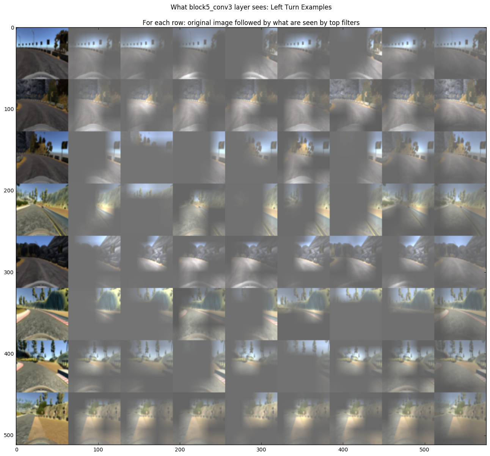

# Udacity Self Driving Car Nano Degree - Behavior Cloning Project

## 1. Quick Start

### 1.1 Prerequisites
- Use `pip -r requirements.txt` to install python packages
- Download [driving simulators from Udacity](https://d17h27t6h515a5.cloudfront.net/topher/2016/November/5831f0f7_simulator-linux/simulator-linux.zip)
- Download [zipped model files](https://github.com/dolaameng/Udacity-SDC_Behavior-Cloning/releases/download/v0.1/models.zip) and unzip it to create the `models` sub-folder.
- Optionally create a subfolder `data` and save your training data in it, if you want to build a model on your own data. An example of the `data` folder structure is:
```
data
├── headers.csv
├── t1b1
│   ├── driving_log.csv
│   └── IMG
├── t1b2
│   ├── driving_log.csv
│   └── IMG
├── t1c1
│   ├── driving_log.csv
│   └── IMG
```
where `t1b1`, `t1b2` are different training sessions from simulator, with generated images in `IMG` and driving logs in csv.

### 1.2 Use a pretrained model to drive in simulator
To start the self-driving model, run the following command from the root folder, 
```cmd
python -m sdc.drive
``` 
Run the Udacity simulator in autonomous mode to start driving. The script will load models saved in `models/model.json` and `models/model.h5` by default.

### 1.3 Train your own model
There are two steps to train a model based on your own data, 
- Put data somewhere, e.g., in `data` folder
- Config the training data in `sdc/config.py` by setting the `train_data` variables (examples are given in the script).

To build a model from scratch, run
```cmd
python -m sdc.train_regression --train --nb_epoch 6
```
where `sdc.train_regression` build a vgg16-based regression model from CenterImage to Steer. `--nb_epoch` is the number of training epoches.

To continuously train a model from a previous one, run
```cmd
python -m sdc.train_regression --train --restore --nb_epoch 6
```

To load a trained model to evaluate on test data without any training, simply run
```cmd
python -m sdc.train_regression --restore
```

### 1.4 Inspect Training Results
The training script will split data into `training`, `validation` and `test` sets. The sizes of `validation` and `test` are 10K each by default, which can be configured in `sdc/train_regression.py` script.

After each training/evaluation run, a test result will be saved in `tmp/test_result.csv`. Use `insepct_training.py` to load and inpsect the result.  You can also run the ipython notebook `understand_model.ipynb` to ***visualize*** the self-driving-model based on test results.


## 2. Code Organization
- `sdc/`: self-driving-car python package
	- `train_regression.py`: the main entry point to build/train/evaluate a SDC model. It treats steering prediction as a regression problem and so the name. It is currently the only training script implemented.
	- `config.py`: configuring the training process, e.g., training data, selected model, image preprocessing and etc.
	- `data.py`: implements `DataSet` class that reads and processes images in batches to feed deep learning models.
	- `process.py`: implements different preprocessing methods for different settings.
	- `model.py`: implements `SteerRegressionModel` class that encapsulates several deep learing architectures, e.g., `VGG16 pretrained model`, `VGG16 multiple-layer as inputs`, `Nvidia model` and `comma.ai model`. The configuration and selection of these models can be referred to in `config.py`.
	- `drive.py`: implements simulated driving. It is a modified version of the script provided by Udacity. 
- `tests/`: test scripts for sdc pacakge
- `data/`: training data
- `models/`: saved models from training
- `tmp/`: storing temporary results, e.g., `test_result.csv`
- `insepct_training.py` and `understand_model.ipynb`: scripts to inspect and visually understand generated models.

## 3. Model Building
### 3.1 Approach Outline
I started by looking at some existing works on self driving cars, including,
- [Udacity self-driving-car project](https://github.com/udacity/self-driving-car)
- [DeepDrive](http://deepdrive.io/)
- [commma.ai research](https://github.com/commaai/research)
- [Nvidia Paper: End to End Learning for Self-Driving Cars](https://arxiv.org/pdf/1604.07316v1.pdf) and [one of its tensorflow implementation in tf](https://github.com/SullyChen/Autopilot-TensorFlow)
- [Dan Does Data youtube channel](https://www.youtube.com/user/dvbuntu) - had a lot of funs watching it
- George Hotz has just open-sourced his [SDC project](https://github.com/commaai/openpilot) when I am writing this, but I haven't got a chance to look at it yet.

I am interested in trying different pipelines that are choices at multiple steps, e.g., data generation/augmentation, image/output preprocessing, and modelling. So the next step for me was to build up scaffolds to experiment with those stuff. In details,
- `DataSet` in `data.py` implements a data generator that reads many images without fitting them all in memory. It also implements on-the-fly data preprocessing/augumentation as plugins to the data generator. I have particularly played with the following:
	- Augmenting data by mirroring images and negating their steers (already normalized to [-1, 1])
	- Removing noise data by filtering out drivings that don't meet certain conditions (e.g., very low speed)
	- Smoothing the steering by a rolling-average along time
	- Shuffling batches in training
	- Spliting data into different sets such as training, validation and test
	- Selecting different features as inputs/outputs, such as *CenterImage -> Steering*, *CenterImage + Speed -> Steering* and etc
- Methods in `process.py` implement different image/steering preprocessing, e.g.,
	- Scaling original images to different sizes
	- Different color channels, RGB v.s. YUV and etc
	- Normalization, e.g., pixels to [0, 1] or [-1, 1]
	- Preprocessing required by certain models, e.g., pretrained VGG16 works best with images normalization by fixed means, and certain color channel (BGR).
	- Encoding Steering by discretizing it, e.g., by [$\mu$-law](https://en.wikipedia.org/wiki/%CE%9C-law_algorithm), as what people did in [Wavenet](https://deepmind.com/blog/wavenet-generative-model-raw-audio/)
- Different models are implemented in `model.py`, including
	- `_build_nvidia()` method: CNN models described in the Nivida paper.
	- `_build_vgg16_pretrained()` method: Bottleneck features from VGG16 pretrained model (on ImageNet) and 3 dense layers as new head. Only two layers, namely `block5_conv2` and `block_conv3` from the pretrained model are set as trainable for fine-tuning, with other layers fixed.
	- `_build_vgg16_multi_layers` method: another model based on pretrained VGG16. But this time, outputs from mulitple conv layers are concated to be the input feature to the final dense layers. I experiemented with this because outputs at different layers might capture image features at different levels - e.g., lines/corners at low levels, trees/sky at high levels, which might be all useful in self-driving based on road conditions. I didn't choose to normalize each output before concating them, mainly because of the computation cost. However, it's possible that outputs from different layers may have different value ranges. 
	- `_build_comma_ai`: it's the ***simple*** model described in comma.ai/research github. Its architecture is similar to the NVIDIA model, with slight differences in setting up each layer. 
- Configurations of different pipelines are all done in `config.py`.
- Actual training happens in `train_regression.py`. This script builds models to predict numerical steering soley based on images of center cameras. There are other ways of training, e.g., building a classfication model based on discretized steerings. I didn't keep them here because their performances were not as good in my experiments. 

To compare different pipelines I need some evaluation tools. Besides the simulation platform provided by Udacity, I also did some quick check in `inspect_training.py`. It includes three types of quick inspection:
- Scatterplot of real vs predicted steerings on test data. It helps me quickly spot outliers and distributions of predictions.
- Showing images of top best predictions and mistakes. It helps me gain some understanding of how the model was behaving.  
- It saves the evaluation on test as a csv, so later other inspections such as visualizations in `understand_model.ipynb` can be built on top of it.

After some explorations, I was finally comfortable with using the VGG16 based model, predicting steers as a regression problem. I will explain this setup in details below.


### 3.2 Data Generation & Processing
**One lesson that I have learned in this project is the importance and power of sufficient data in training deep learning models.** I have observed significant performance boosts several times when new data were used. 

The Udacity simulator records user's driving behaviors by saving the images of `left/center/right cameras`, as well as `driving logs` such as `steering angle`, `throttle`, `brake` and `speed` as time serieses. The driving is on fixed tracks without any traffic. As a result, there are some challenges in generating the data,
- In a short time window, the generated images might be visually similar whereas the change of steering are big, e.g. at road turnings. So to drive successfully, the model is forced to learn subtle differences in similar images.
- On the other hand, the model still needs to learn to generalize by finding common patterns of, e.g., right steerings, from very different images, e.g, scenes at lake side or mountain road. In other words, the "noise" in the raw image representations might be stronger than the "signals" for this learning problem. So I doubt any models that only use raw image representations (e.g., MLP, k-NN) would work.
- Driving in a traffic free environment is easy to generate data that are too clean to capture the *variances of real driving behaviors*. For example, a model might memorize to go straight on a straight road based on the training data, but fail to drive back when there is a slight drifting in test.
- The steerings in the simulation are imbalanced (on purpose?). There are usually more left/right turnings for one track. This makes any training based on popular regression costs such as MSE (mean-squared-error) difficult, because it will be easy for the model to learn to predict the majority. 
- Similarly, there are rare scenes/locations in simulations, e.g., short bridge crossing. A model might have difficulties of learning from them if there are not enough related data in training. ***In fact, I often used the models' behaviors on the rare scenes as a quick check for model overfitting.*** If the model learns well, it should be able to use the general knowledge for rare scenes, instead of memorizing the scenes themselves.
- Even it is driving in a simulated platform, sometimes it is hard to get the desired quality. I used to drive with many small steerings at turnings - the generated data prove to be less useful in my experiments. I also need to remove some noise in data, e.g., over-steerings. 

To overcome some of the challenges, I have experimented with several data generating ways, e.g., "course correction" suggested by many researches, as well as preprocessing of data including mirroring, smoothing, noise-removing that are discussed above. The following is a list of datasets used in the final experiment, with their descriptions. 
- `t1r1, t1r2, t1r3, t1r4, t1r5`: track 1, "proper driving" run1 to run5, 46,230 images in total.
- `t1b1`: track1, additional driving for rare scene bridge-crossing, 5,589 images - it turns out to be less useful after the model stablizes.
- `t1w1`: track1, "wiggle driving", 7,495 images. *I didn't strictly follow the "course correction" suggested in the literature, which involves moving the car to a side and only recording the correction part. Instead I was just driving the car in a wiggle way (not realistic in practice though) and recording everything.* My idea is that the model will just learn the correction part and the pre-stage will be "diluted" by enough proper driving because we have a lot of them with car in the center of roads.
- `t1rr1`: track1, driving in the reverse direction, 18,057 images. It turns out to be less useful after `mirroring` is used to the data.
- `t2r1, t2r2, t2r3, t2r3.1, t2r4`: track 2, "proper driving" runs, 19,261 images in total.
- `t2w1`: track2, "wiggle driving", 761 images.

After removing some data and mirroring the steerings, there are 166,656 images in training set, 10,000 images in each of validation and test sets.

### 3.3 Model Architecture
The final model I used in the submission is a [pretrained VGG16 model](https://github.com/fchollet/keras/blob/master/keras/applications/vgg16.py) with the following modifications:
- I use the bottleneck features up to `block5_conv3`, freezing the training of all layers except the last two, namely `block5_conv2` and `block5_conv3`. 
- An `AveragePooling2D` layer is used after `block5_conv3`, to further downscale the images. 
- A `BatchNormalization` layer is used to speed up the training convergence - the pretrained VGG16 model has an input value range roughly from -128 to 128, which may make the training of top dense layers a little slower with default initialization.
- Two `Droputout` layers are used before and after the `BatchNormalization` layer - I am not really sure whether it is equivalent to using a single dropout because it will influence the outputs of BatchNormalization.
- Then a `Flatten` layer is used, followed by 3 `Dense` layers, each has an output size of 4096, 2048, 2048. Each dense layer is trained with a `l2` regularizer - based on the assumption that similar image inputs should generate smooth steering changes, so the model weights should not be too large. The first two dense layers are also followed by dropout layers to further regularize the model.
- I also used the [`elu`](https://arxiv.org/abs/1511.07289) for the dense layers for faster training convergence based on some literature study.
- The top output layer is a single neuron with a `linear` activation. I have also tried other activations such as `tanh`, `sigmoidal` and found the `linear` activation works just well in predicting steerings in [-1, 1] range.

With the model above, I also found the following processing steps useful in generating good results. 
- Scaling the images to squares. The VGG16 model was trained on images size (224 x 224 x 3), so I found it works better with images of equal width and height. I was gradually downsizing the image sizes until a signifcant performance loss was observed. That gave me an estimate of optimal image size (80 x 80 x 3) for model input.
- I was using the standard preprocessing for the pretrained VGG from `Keras`, including subtraction of means in BGR channels.
- I have experimented with how the pretrained layers of VGG16 should be *fine-tunned*. I found that the bottleneck features without any fine-tunning works well with data of medium size (e.g., before mirroring the images and doubling the size), and bigger dataset provides the luxury of fine-tunning the last two layers `block5_conv2` and `block5_conv3`. Making more layers trainable doesn't gain much more performances given the current dataset.

### 3.4 Training
As discussed above, several mechanisms were implemented to ***avoid overfitting***,
- Split of dataset into training, validation and test after random shuffling, so that the validation loss can be monitored in the training process. I didn't see many "typical" overfitting in my experiments, i.e., the validation loss starts to increase while training loss keeps decreasing, probably because the size of the dataset is large enough, and the images in different sets are similiar. However, it doesn't mean that the driving model is not "overfit" -  the model can still memorize images and it won't drive very well in scenes that are slightly different from training data. One example is the car self drives to cross a bridge at a slightly different angle, it might fail to come back to the road center. This is because even the training data is large enough overally but some of its rare scenes (e.g., bridge-crossing) might not be representative enough. So the model overfits and fails to generalize the "drivinig knowledge" from scenes to scenes. This type of overfitting is harder to detect by comparing training/loss validation curves.   
- So besides using a validation set, I have also implemented visual inspection tools (e.g., `inspect_training.py`) to do quick checks, as well as running the model on the real simulation from Udacity. 
- I used both `dropout` layers and `l2 regularization` to control the model complexity. The values of parameters such as `dropout probability` and `l2 weight` are mostly based on default values and were fine-tuned with validation error.
- I found that `l2 regularization` tends to work better with the `dense layers` than using a separate `dropout layer`. Sometimes using dropout with dense layers will result in predictions of all zeros. I don't really know the exact reasons behinde this, but I suspect it might be caused by the improper initialization of weights or normalization of images, and so dead neurons by `relu` and a large `dropout` effectively turned off many activations. 

The model was trained on a GPU GTX 980M for 6 epochs within an hour. Both the training and validation loss were still decreasing at the last epoch. However, I chose to stop the training at this stage for two main reasons:
- The model trained after 6 epochs is already able to self-drive on both tracks in most of my expriements.
- More training could further improve the "cloning accuracy" of the model of my driving behaviors. However, as mentioned above, this might be another type of "overfitting" for a self-driving model, due to the noise in the training data.

I used Adam optimizer with a learning rate = 0.001. The performance is not very sensitive to the exact value of learning rate in my experiments.

### 3.5 Driving in Simulators
To test the model under the autonomous mode in the simulator, I was using the `drive.py` script provided by Udacity with some modifications. The script has the access to all the camera images and signals, and the control of `steering angle` and `throttle`. You can even choose to cache the inputs from previous timestamps and build a recurrent model like the one by comma.ai research.

I only use the current `center image` to predict the current `steering angle` in my experiments. The `throttle` was set to a fixed value 0.5 for both tracks. 

## 4. Results
Here are some videos for running my SDC model in the simulator.
### First finish of track 1
[](https://www.youtube.com/watch?v=_VyUSNcQ0UE)

### Finish of both tracks
[](https://www.youtube.com/watch?v=CU5zCB63rvY)

### Model visualization
I am also interested in understanding how the trained model actually works. One way is to visualize the regions of images that trigger high activations in certain convolution layers, e.g., `block5_conv3`. For example, [this paper](https://arxiv.org/abs/1505.04366) discusses how to use `deconvolution` layers to reverse-map a single classification output to the original image space, and thus get a semantic segmentation. 

I am not using `deconvolution` layers but instead a cheaper `image resize` operation to approximate the effect. It is similar to `unpooling` but much cheaper to implement. This is only possible because the layer I choose still has enough details to restore in the original image space. The following shows what a SDC model "sees" at left/right turnings. Intuitively the brighter the regions, the more important they are to the model decision. 

### What a SDC model sees at left turning


## What a SDC model sees at right turning 


For a verbose explaination, please refer to the notebook [understand_model.ipynb](understand_model.ipynb)

<br><br>
*The conversion of this Markdown to HTML is supported by [grip](https://pypi.python.org/pypi/grip), running* `grip README.md --export README.html`